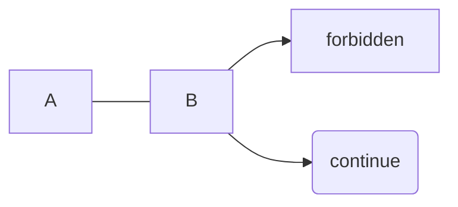
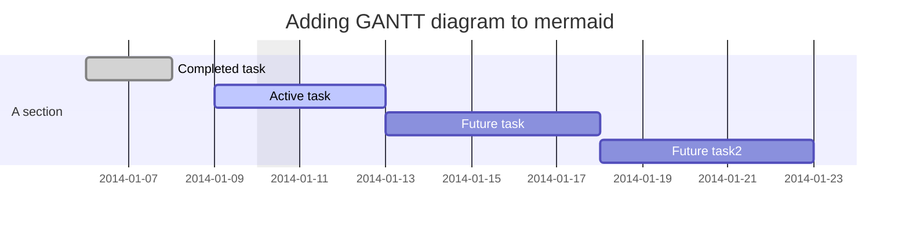

# Support Markdown Plugins

## Toc
[toc]

Toc will be seperated to right side.

Note: Only `h2` and `h3` are shown in toc.

## Alert

Alert is similar to fenced code blocks. Valid container types are `success`, `info`, `warning` and `error`. Any inline rules coubld be used inside of alert.

::: success
Success. You have got it.
:::

- test
  ::: info
  Info. Indent also work for this.
  :::

::: warning
Warning. You have new mail.
:::

::: error
Error. Staying up all night is bad for health.
:::

## Definition list

[Definition List Docs](http://pandoc.org/README.html#definition-lists)

Term 1
  ~ Definition 1

Term 2
  ~ Definition 2a
  ~ Definition 2b

```text
Term 1
  ~ Definition 1

Term 2
  ~ Definition 2a
  ~ Definition 2b
```

## Subscript

H~2~O `H~2~O`

## Superscript

29^th^ `29^th^`

## Insert & Delete

!!delete!!  `!!delete!!`

++insert++  `++insert++`

## Emoji

:panda_face: :sparkles: :camel: :boom: :pig:

`:panda_face: :sparkles: :camel: :boom: :pig:`

[Emoji Cheat Sheet](http://www.emoji-cheat-sheet.com/)

## Mdi icons

:mdi-transit-detour :mdi-access-point-check :mdi-chart-box `:mdi-transit-detour :mdi-access-point-check :mdi-chart-box`

[Mdi icons list](https://cdn.materialdesignicons.com/5.4.55/)


## Checkbox

- [x] Have you squashed your commits to a single commit?
- [ ] Does your commit have a short and precise description of the changes implemented?
- [ ] Have you rebased from master?

```
- [x] Have you squashed your commits to a single commit?
- [ ] Does your commit have a short and precise description of the changes implemented?
- [ ] Have you rebased from master?
```

## Mermaid charts

[Mermaid Docs](https://mermaid-js.github.io/mermaid/#/README)



```text
// use code block with mermaid tag

```mermaid
graph LR
      A --- B
      B-->C[forbidden]
      B-->D(continue);
// ```
```



```text
// use code block with mermaid tag

```mermaid
gantt
dateFormat  YYYY-MM-DD
title Adding GANTT diagram to mermaid
excludes weekdays 2014-01-10
section A section
Completed task            :done,    des1, 2014-01-06,2014-01-08
Active task               :active,  des2, 2014-01-09, 3d
Future task               :         des3, after des2, 5d
Future task2              :         des4, after des3, 5d
// ```
```

## Echarts

[Documentation for Echarts](https://echarts.apache.org/en/index.html)

The width and height is the size for chart container.

```echarts
{
  "width": 500,
  "height": 400,
  "series": [
    {
      "name": "Inventory",
      "type": "pie",
      "radius": "55%",
      "data": [
        {
          "value": 235,
          "name": "Virtual Machines"
        },
        {
          "value": 274,
          "name": "Blade Servers"
        },
        {
          "value": 310,
          "name": "DNS Zone"
        },
        {
          "value": 335,
          "name": "DNS Records"
        },
        {
          "value": 400,
          "name": "DNS NameServers"
        }
      ]
    }
  ]
}
```

```text
// use code block with echarts tag

```echarts
{
  "width": 500,
  "height": 400,
  "series": [
    {
      "name": "Inventory",
      "type": "pie",
      "radius": "55%",
      "data": [
        {
          "value": 235,
          "name": "Virtual Machines"
        },
        {
          "value": 274,
          "name": "Blade Servers"
        },
        {
          "value": 310,
          "name": "DNS Zone"
        },
        {
          "value": 335,
          "name": "DNS Records"
        },
        {
          "value": 400,
          "name": "DNS NameServers"
        }
      ]
    }
  ]
}
// ```
```
